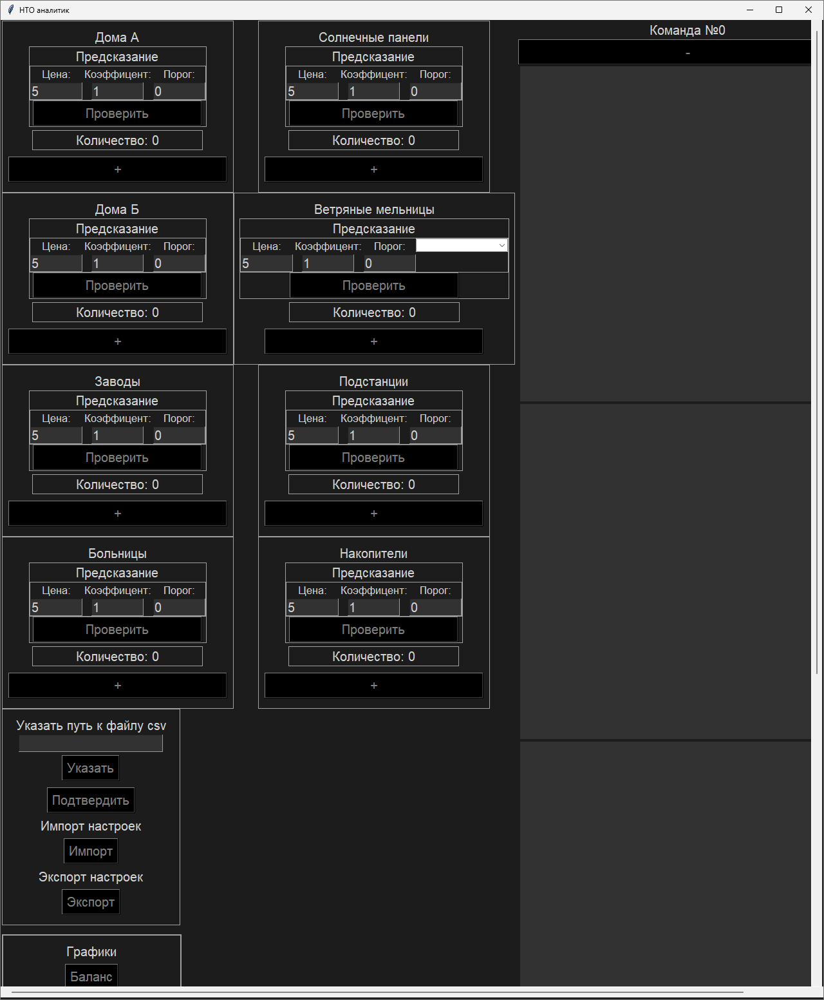

# НТО аналитик

Помощник на аукционе инфраструктуры.\
Создан во время подготовки к Национальной Технологической Олимпиаде по профилю Интелектуальные Энергетические Системы.\
Я участвовал дважды и поэтому было создано две версии. \
Старая версия лежит в папке [v1.0](v1.0). К ней есть [презентация](attachment/НТО%20аналитик.pptx). \
[Есть пример погоды, для теста программы](attachment/forecast_example.csv)
## Возможности программы
- Предсказание результатов игры на основе имеющейся инфраструктуры
- Возможность быстро посмотреть изменение результатов при покупке или сбросе любого объекта
- Перед покупкой можно посмотреть минимальную/максимальную (зависит от объекта) безубыточную цену
- Можно следить одновременно за несколькими командами
## Условия для которых создавался интерфейс
Да, он не масштабируемый. Можно разве что поскролить его по двум координатам. Я знал на каких мониторах будет запускаться программа:
- v1.0: 2560x1440 с системным масштабированием 100%

- v2.0: 2560x1440 с системным масштабированием 100-125%

## Отличия v1.0 от v2.0
- Уменьшен размер интерфейса, чтобы меньше пользоваться скроллом
- Некоторые элементы интерфейса перешли на верхнее меню
- В окне предсказаний текст заменён на графики. Это сделало окно компактнее и информативнее \
 => 

- Удалено окно баланса. Оно было не эффективно

## Технологии
- tkinter
## Проблемы
- Последняя версия медленно ведёт расчёты при большом количестве объектов
